+++
title = 'Laws of Logic'
type = 'chapter'
weight = 5

[params]
  section = 5
+++

At this point, we're familiar with the fundamental unit of logic — the
proposition. We've seen how to combine them into compound propositions,
and how to use truth tables to identify propositions that are always
true — tautologies.

With these tools, we are ready to start discussing the heart of logical
deduction and our unique ability to reason — the Laws of Logic!

## A Simple Example
---

Before we dive into the deep end, let's wade in a shallow example where we
examine a few propositions that involve the biconditional connective.


As usual, we can construct a truth table showing all intermediary values.

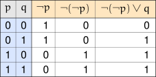

The final column resembles the truth table for the compound proposition
$p \lor q$:

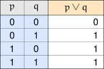

So under all the exact same circumstances (meaning, same combinations of
truth values for $p$ and $q$) the expressions $\neg (\neg p) \lor q$ and
$p \lor q$ have the same truth value.

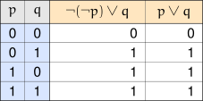

Let's examine the double negation more closely:

We see that $p$ and $\neg \neg p$ have the exact same truth values,
regardless of what value $p$ has.

Since $p$ and $\neg \neg p$ always have the same truth values under all
conditions, we can swap them out with each other in expressions, without
affecting the overall truth value.

This explains why $\neg \neg p \lor q$ and $p \lor q$ have the same truth
values for all combinations of truth values for $p$ and $q$; because we
can swap out $\neg \neg p$ with just $p$ without affecting the truth
values.

Notice that because $\neg \neg p$ and $p$ have the same truth values, we
expect the biconditional connecting them to always be true — a tautology:

\[
\begin{array}{l|l|l|l|l}
p & \neg p & \neg \neg p & \neg \neg p \leftrightarrow p & \text{Result} \\
\hline
0 & 1 & 0 & (0) \leftrightarrow (0) & 1 \\
1 & 0 & 1 & (1) \leftrightarrow (1) & 1
\end{array}
\]

It is as expected:

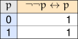

Furthermore,

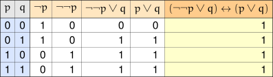

So we see that $(\neg \neg p \lor q) \leftrightarrow (p \lor q)$ is a
tautology. We prefer $p \lor q$, since it's a simpler expression than
$\neg \neg p \lor q$.


In the previous example we saw how — when the biconditional between two
propositions is a tautology — we can essentially just swap out one
expression that has the same behavior under its atomic propositions for
another, without changing the overall truth value.

Let's see another example.


We may suspect that the order we list the atomic propositions in a
disjunction may not actually matter, but we can easily verify this with a
truth table:

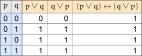

So we now see that whenever we see a disjunction between two
propositions, we can swap the order without affecting the truth value.


Let's see one more example of some "equivalent" expressions.


Again, let's organize our results into a truth table:

Based on this example, we now know that if we ever see a proposition
disjunctioned with itself, we can just replace the entire disjunction
with a single copy of the atomic proposition used.


We just saw three examples of biconditionals that were tautologies. A
reasonable next question would be "so what?"


This proposition uses the three kinds of propositions we saw in the three
previous examples. We can probably guess where this example is leading,
but let's continue on.

We've kept parentheses around every grouping here on purpose. We haven't
justified anything about *rearranging* parentheses yet — only swapping the
order of a disjunction's two sides, and collapsing a disjunction with
itself — so we'll stick to those two moves and keep checking our work
with a truth table at every step.

We suspect we can replace $\neg \neg p$ with just $p$, like so, without
affecting the overall truth value:

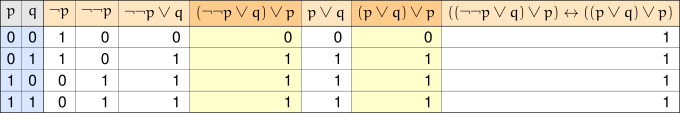

So we can still replace $\neg \neg p$ with just $p$ and still get the
same truth values:

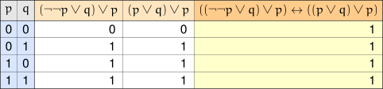

Let's continue examining $(p \lor q) \lor p$ instead.

Previously we also saw that in a disjunction, we could swap the
propositions without affecting the overall truth value. Let's see if we
can swap out $p \lor q$ for $q \lor p$ without affecting the truth value:

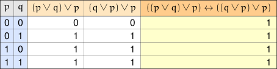

Ok, we still get the same truth values under the same combinations of
truth values for $p$ and $q$.

Let's keep rearranging things this way, still checking our work with a
truth table at every step, until the two copies of $p$ end up sitting
right next to each other:

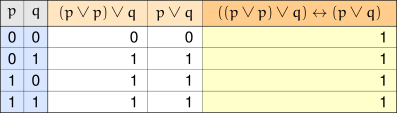

We also saw that we could replace a disjunction between a proposition and
itself with just that proposition. Since $(p \lor p)$ behaves just like
$p$, this leaves us with $p \lor q$ — matching what the table above
already confirms.

Hence we see that

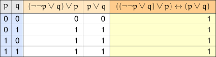

Meaning the proposition $((\neg \neg p \lor q) \lor p) \leftrightarrow (p \lor q)$
is a tautology. Both $(\neg \neg p \lor q) \lor p$ and $(p \lor q)$ have
the exact same behavior under all combinations of truth values for $p$
and $q$.

In essence, what this means is that whenever we encounter the expression
$(\neg \neg p \lor q) \lor p$, we can fully understand it by examining
$(p \lor q)$ instead — we can basically just replace
$(\neg \neg p \lor q) \lor p$ with $(p \lor q)$ without affecting
anything.

Being as $(p \lor q)$ is much simpler than $(\neg \neg p \lor q) \lor p$ —
without all the extra copies of the $\neg$ symbol, the extra $\lor$
symbols, or the extra copy of proposition $p$ — we'd rather work with the
expression $(p \lor q)$.


The past couple of examples have demonstrated how complicated expressions
can be replaced (and better understood) with simpler expressions.

## Logical Equivalence
---

The reason why we can replace a complicated proposition with a simpler
proposition is because that simpler proposition exhibits the exact same
behavior as the more complicated proposition when the atomic propositions
assume — or take — the same combination of truth values. By "the same
behavior," we mean they have the same truth values, meaning the
biconditional is a tautology.


Two propositions $S_1$ and $S_2$ are called ==logically
equivalent==, and we write

$$S_1 \Leftrightarrow S_2$$

whenever the biconditional

$$S_1 \leftrightarrow S_2$$

is a tautology.


At least one of $S_1$ and $S_2$ needs to be compound for this to be
interesting. We actually already saw an example where only one side was:
$\neg \neg p$ is logically equivalent to just $p$, even though $p$ itself
is primitive. Comparing two primitive propositions to each other isn't
nearly as useful — a primitive proposition's truth value doesn't depend
on the truth value of any other proposition, so there's no combination of
truth values to check across.

Logical equivalence is the basis for the Laws of Logic.

## Laws of Logic
---

The Laws of Logic are nothing more than a list of logical equivalencies.

Here, we present a rather long list of known logical laws.

|  |  |
|---|---|
| Law of Double Negation | $\neg \neg p \Leftrightarrow p$ |
| DeMorgan's Laws | $\begin{array}{c} \neg (p \land q) \Leftrightarrow \neg p \lor \neg q \\ \neg (p \lor q) \Leftrightarrow \neg p \land \neg q \end{array}$ |
| Commutative Laws | $\begin{array}{c} p \land q \Leftrightarrow q \land p \\ p \lor q \Leftrightarrow q \lor p \end{array}$ |
| Associative Laws | $\begin{array}{c} (p \land q) \land r \Leftrightarrow p \land (q \land r) \\ (p \lor q) \lor r \Leftrightarrow p \lor (q \lor r) \end{array}$ |
| Distributive Laws | $\begin{array}{c} p \land (q \lor r) \Leftrightarrow (p \land q) \lor (p \land r) \\ p \lor (q \land r) \Leftrightarrow (p \lor q) \land (p \lor r) \end{array}$ |
| Idempotent Laws | $\begin{array}{c} p \land p \Leftrightarrow p \\ p \lor p \Leftrightarrow p \end{array}$ |
| Identity Laws | $\begin{array}{c} p \land T_0 \Leftrightarrow p \\ p \lor F_0 \Leftrightarrow p \end{array}$ |
| Inverse Laws | $\begin{array}{c} p \land \neg p \Leftrightarrow F_0 \\ p \lor \neg p \Leftrightarrow T_0 \end{array}$ |
| Domination Laws | $\begin{array}{c} p \land F_0 \Leftrightarrow F_0 \\ p \lor T_0 \Leftrightarrow T_0 \end{array}$ |
| Absorption Laws | $\begin{array}{c} p \land (p \lor q) \Leftrightarrow p \\ p \lor (p \land q) \Leftrightarrow p \end{array}$ |

Just like we did in the examples, all of the above can be verified by
examining a truth table containing a biconditional and determining
whether or not the biconditional is a tautology.

## Some More Laws of Logic
---

There are a couple more logical equivalencies that prove to be useful.

|  |  |
|---|---|
| Law of Material Implication | $p \to q \Leftrightarrow \neg p \lor q$ |
| Law of Material Equivalence | $p \leftrightarrow q \Leftrightarrow (p \land q) \lor (\neg p \land \neg q)$ |
| Exclusive-or Equivalence | $p \veebar q \Leftrightarrow (p \land \neg q) \lor (\neg p \land q)$ |
| Law of Mutual Implication | $p \leftrightarrow q \Leftrightarrow (p \to q) \land (q \to p)$ |
| Negated Biconditional Equivalence | $p \veebar q \Leftrightarrow \neg (p \leftrightarrow q)$ |