+++
title = 'Modeling Logic with Truth Tables'
type = 'chapter'
weight = 2

[params]
  section = 2
+++

We are often working with three or more propositions at a time, usually
combined into large numbers of expressions made using the logical
connectives discussed previously.

It can be cumbersome to work with them individually. Here, we will learn a
technique for handling multiple expressions efficiently.

## A Convenient Shorthand
---

To make our upcoming work easier, we adopt a common shorthand for truth
values:

\[
\begin{align*}
\text{False / false: } 0 \\
\text{True / true: } 1
\end{align*}
\]

Using numbers will make the following concept a bit more space efficient,
and give a more mathematical flavor going forward.

## Atomic Propositions: Building Blocks of Truth Tables
---

A truth table is simply a table organizing multiple logical expressions
based on the truth values of their constituent, or *atomic* propositions.

By *atomic*, we mean propositions used to construct compound propositions
by combining them with logical connectives.

In the expressions

\[
\begin{align*}
& \neg p \\
& p \land q \\
& p \lor q \\
& p \veebar q \\
& p \longrightarrow q \\
& p \longleftrightarrow q
\end{align*}
\]

$p$ and $q$ are considered *atomic*.

Note that atomic propositions themselves do *not* need to be primitive.


Let $p$ and $q$ be compound propositions defined as follows:

\[
\begin{align*}
p: a \land b \\
q: a \lor b
\end{align*}
\]

In the context above, $a$ and $b$ are the atomic propositions.

Now reconsider the six expressions from earlier:
- $\neg p$
- $p \land q$
- $p \lor q$
- $p \veebar q$
- $p \longrightarrow q$
- $p \longleftrightarrow q$

Here in these expressions, $p$ and $q$ are also considered atomic, since
they are named propositions being connected together to form compound
propositions. We could go a step further and substitute in the definitions
of $p$ and $q$ given above, in terms of the propositions $a$ and $b$:
- $\neg (a \land b)$
- $(a \land b) \land (a \lor b)$
- $(a \land b) \lor (a \lor b)$
- $(a \land b) \veebar (a \lor b)$
- $(a \land b) \longrightarrow (a \lor b)$
- $(a \land b) \longleftrightarrow (a \lor b)$


In general, a proposition that is named or labeled (usually with a
lowercase letter) is considered atomic because it can be used to build up
other propositions when combined with other labeled propositions using the 
logical conenctives.

## Constructing Truth Tables
---

As stated before, a truth table is simply a table showing the truth value
of a logical expression based on the truth values of its atomic
propositions.

Here is an overview:

1. We start with the given expression, and identify all atomic propositions
   used to form it.
2. We create a table with enough columns for all of the atomic propositions
   as well as the desired logical expression. We list all atomic
   propositions in the left-most columns, in alphabetical order. The last,
   right-most column is reserved for the desired proposition.
3. Under the columns for the atomic propositions, we list all possible
   combinations of truth values between the atomic propositions. A good way
   to ensure that all combinations are listed is to follow a "rotary,"
   "dial," or "odometer" method, where the right-most atomic proposition's
   values change the most frequently between rows, and the first,
   left-most atomic proposition's values cycle the least frequently between
   rows. Instead of dialing through digits 0 through 9 like an odometer,
   you flip back to 0 after reaching 1.
4. For each row, evaluate the desired logical expression by substituting
   that row's truth values in for its atomic propositions.

This yields a complete truth table for your desired expression. Let's see
an example where we fill out a truth table for the logical expression
$p \land q$:


++Step 1: Identify the atomic propositions++

For $p \land q$, the atomic propositions are $p$ and $q$.

++Step 2: Create an initial table that has enough columns to hold the atomic propositions and the desired proposition++

There are two atomic propositions, along with the desired proposition, so
our table needs three columns: $p$, $q$, and $p \land q$. We list the
atomic propositions first, in alphabetical order, and then end with the
desired proposition.

++Step 3: List all possible combinations of truth values for the atomic propositions being used++

Here is what the overall table's structure will look like. In this book, we will use a
blue color to color in all of the values for the atomic propositions, and
an orange color for the desired expression's column.

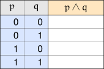

Examine the way the truth values for the atomic propositions have been laid
out. As described earlier in the overview, we are listing each combination
of truth values by essentially using a rotary or dial system. This ensures
we list all possible combinations of truth values.

++Step 4: Fill in all of the missing truth values under the desired proposition's column++

Let's do this one row at a time. Let's start with the first row, where
$p = 0$ and $q = 0$, highlighted in this table:

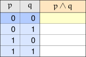

What value do we fill in to the highlighted, yellow cell? We need to refer
back to the definition of conjunction: the conjunction of two propositions
$p$ and $q$, denoted $p \land q$, is true only when both $p$ and $q$ are
true. If either $p$ or $q$ is false, then the conjunction itself is false.

Remember that we use $0$ to represent a false truth value, and $1$ to
represent a true one. In the row we're examining, both $p$ and $q$ are
false, since both are equal to $0$. Since not both $p$ and $q$ are true,
$p \land q$ is false, so we write $0$ in the highlighted cell, as shown
below:

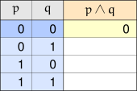

This leaves us with the following partially filled out table:

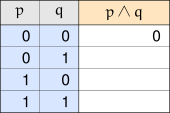

We continue on to the next row, where $p = 0$ and $q = 1$, highlighted
below:

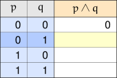

Appealing to the definition, since one of the atomic propositions is
false — here, $p = 0$ — the conjunction $p \land q$ is also false. We place
a $0$ in the highlighted cell, shown below:

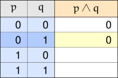

This leaves us with a slightly more filled out table, shown below:

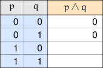

Let's continue on and examine the third row, where $p = 1$ and $q = 0$.
Here, since one of the atomic propositions is false, the conjunction
$p \land q$ continues to be false, and we fill in a $0$ in the third blank
cell, shown below:

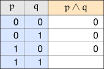

Now we are on the last row, where $p = 1$ and $q = 1$. Here, both atomic
propositions are true. This means the conjunction $p \land q$ is, by
definition, true. That means in this final blank cell we fill in a $1$,
leaving us with the completed truth table for the conjunction $p \land q$:

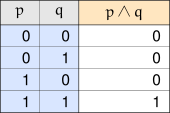


This example shows the basic procedure. From now on, we can just fill in
the values as needed, without any need to repeat any of the exposition
here.

## Truth Tables for the Logical Connectives
---

We have seen how to construct a truth table from scratch. Now, it's really
just a matter of appealing to the definitions of the logical connectives in
order to construct truth tables for them. Knowing the truth tables for the
logical connectives is going to make working with even more complicated
expressions much easier, since any complicated expression is essentially
just a bunch of atomic propositions combined with the logical connectives
described here.

Here, we are going to use $p$ and $q$ as the atomic propositions for the
expressions.

### Negation $\neg$

This is a really simple truth table, since negation can operate on one
proposition at a time. Remember that the negation of a proposition has the
opposite truth value of the proposition itself.



### Conjunction $\land$

We already saw this in the example above, but we'll show the table here
for the sake of completeness.



### Disjunction $\lor$

Based on the definition of disjunction, we know that if at least one of the
atomic propositions is true, then the disjunction itself is also true.



### Exclusive-or $\veebar$

The definition essentially tells us that the exclusive-or of two atomic
propositions is true whenever the atomic propositions have different truth
values; or put another way, not equal to each other.



### Implication $\longrightarrow$

The definition of implication tells us that the **only** time an
implication is false is if $p$ is true, and $q$ is
false. Otherwise, the implication is true.



### Biconditional $\longleftrightarrow$

The definition for a biconditional essentially tells us that if the two
atomic propositions have the same truth value, meaning they are equal to
each other, then the biconditional itself is true. It is false otherwise.
We can almost think of the biconditional as being the exact opposite of an
exclusive-or between two propositions.



## Combining All Logical Connectives Into One Table
---

Something we can do is simply append the columns for each of the logical
connectives into one big overall table. You have to be careful when doing
this to make sure the rows line up with the appropriate rows for the
atomic propositions. If the order of the atomic propositions differs, or if
the numbering method used yields a different ordering for the combinations
of truth values for the atomic propositions, the results may not be
correct.

Here, we used the same ordering for the atomic propositions themselves,
and the combinations of truth values for those atomic propositions. We
will have to extend the negation table by an additional two rows, but
again, we fill in any values needed by appealing to the definition of
negation, and paying attention to the values of the atomic propositions in
the row we are evaluating.



## Intermediary Columns
---

Notice that we just produced a truth table that has more than one
expression column, one expression column for each of the logical
connectives we use to form compound propositions.

If we are trying to determine the truth value of a complicated expression,
we can do the same thing. We can identify all of the *parts* of the more
complicated expression, and gradually build up the truth value of the
final, desired expression. Doing this helps us keep track of values,
preventing us from having to work out complicated expressions all at once.

We use so-called *intermediary* columns to hold the parts of the
complicated expression that are easy to calculate. Usually, we break a
complicated expression up based on where the logical connectives are. Here
is an example.


Consider the expression $\neg (p \land q)$. Working out its truth value
directly, row by row, means checking $p$, checking $q$, combining them with
conjunction, and *then* negating the result — three things to keep in your
head at once for every row.

An intermediary column makes this easier. We start by building a table
with an intermediary column for the simpler piece, $p \land q$ — a table we
already know how to construct — alongside the column for the desired
expression $\neg (p \land q)$ itself, still blank:

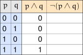

To fill in that blank column, we no longer need to think about $p$ and $q$
at all — we just take the negation of whatever is already in the
$p \land q$ column, one row at a time:

\[
\begin{array}{l|l|l}
p \land q & \neg (p \land q) & \text{Result} \\
\hline
0 & \neg (0) & 1 \\
0 & \neg (0) & 1 \\
0 & \neg (0) & 1 \\
1 & \neg (1) & 0
\end{array}
\]

All we need to do now is copy the **Result** column from the above table into the truth table we are building.

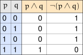

That's the advantage of an intermediary column: instead of working out
$p$, $q$, and the negation of their conjunction all at once, we break the
work into two simple steps, each of which is just a single connective's
truth table.



Consider the expression $p \land (\neg q \lor \neg r)$. This one has three
atomic propositions — $p$, $q$, and $r$ — so its full truth table needs
eight rows, and this time we'll use more than one intermediary column.

We start with intermediary columns for the two simplest pieces, $\neg q$
and $\neg r$:

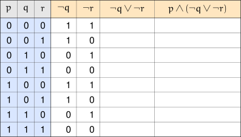

With those two columns in hand, we build a third intermediary column for
$\neg q \lor \neg r$, taking the disjunction of the two columns we just
built, row by row:

\[
\begin{array}{l|l|l|l}
\neg q & \neg r & \neg q \lor \neg r & \text{Result} \\
\hline
1 & 1 & 1 \lor 1 & 1 \\
1 & 0 & 1 \lor 0 & 1 \\
0 & 1 & 0 \lor 1 & 1 \\
0 & 0 & 0 \lor 0 & 0 \\
1 & 1 & 1 \lor 1 & 1 \\
1 & 0 & 1 \lor 0 & 1 \\
0 & 1 & 0 \lor 1 & 1 \\
0 & 0 & 0 \lor 0 & 0
\end{array}
\]

All we need to do now is copy the **Result** column from the above table into the truth table we are building.

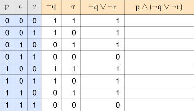

Finally, filling in $p \land (\neg q \lor \neg r)$ is just a matter of
taking the conjunction of $p$ column with the $\neg q \lor \neg r$ column we just
finished — no need to think about $q$ or $r$ individually at all:

\[
\begin{array}{l|l|l|l}
p & \neg q \lor \neg r & p \land (\neg q \lor \neg r) & \text{Result} \\
\hline
0 & 1 & 0 \land 1 & 0 \\
0 & 1 & 0 \land 1 & 0 \\
0 & 1 & 0 \land 1 & 0 \\
0 & 0 & 0 \land 0 & 0 \\
1 & 1 & 1 \land 1 & 1 \\
1 & 1 & 1 \land 1 & 1 \\
1 & 1 & 1 \land 1 & 1 \\
1 & 0 & 1 \land 0 & 0
\end{array}
\]

We then copy the **Result** column from the above table into the truth table we are building, same as usual.

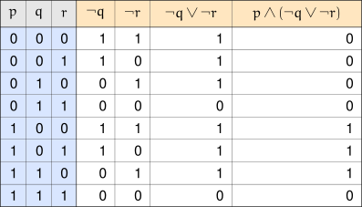

We could leave the table as it is, with a column for every intermediary
piece we used along the way. Or, we could construct a condensed table that
only shows the atomic propositions along with the desired expression.

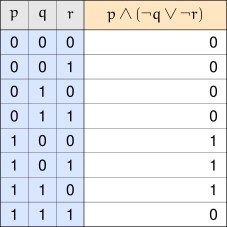

