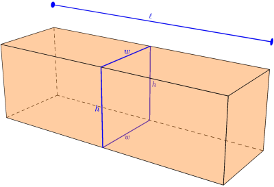

+++
title = 'Open Propositions'
type = 'chapter'
weight = 8

[params]
  section = 8
+++

All of the propositions we've dealt with so far have had definite truth
values. For example,

$$\text{Thomas Jefferson was the second president of the United States.}$$

is a proposition that is known to be false. A statement such as

$$\text{2 + 2 = 4, or 2 + 2 = 5.}$$

is a compound proposition that is true.

However, a statement such as

$$\text{$n$ is 1 more than a multiple of 3.}$$

is not a proposition, because we don't know whether it's true or false. We
would need to know the value of $n$ in order to reach such a conclusion.
For example, the statement is false when $n = 5$, but true when $n = 16$.
Here, we'll deal with sentences involving variables like this one.

## Open Statements
---


Consider the statement

$$x + 3 = 8.$$

Here, we aren't asking what value of $x$ solves the equation (we could,
but that isn't our focus). Instead, we're asking whether, given a
specific value of $x$, the statement is a true proposition or a false
proposition.

We start by modeling the statement using a letter, like we've done up to
this point, but we also use parentheses to denote the variable $x$:

\[
\begin{array}{rl}
p(x)\text{: } &x + 3 = 8.
\end{array}
\]

We can substitute values in for $x$ to get different propositions:

\[
\begin{array}{rl}
p(5)\text{: } &5 + 3 = 8 \\
p(3)\text{: } &3 + 3 = 8 \\
p(-4.73)\text{: } &-4.73 + 3 = 8
\end{array}
\]

We can evaluate some of these propositions:

\[
\begin{array}{ll}
p(5) &= 1 \\
p(3) &= 0 \\
p(-4.73) &= 0
\end{array}
\]



Consider the statement

\[
\begin{array}{rl}
p(x)\text{: } &x \text{ was the 30th president of the United States.}
\end{array}
\]

We can evaluate this statement with many values substituted in for $x$:

\[
\begin{array}{ll}
p(\text{James K. Polk}) &= 0 \\
p(\text{Cecil Rhodes}) &= 0 \\
p(\text{Grover Cleveland}) &= 0 \\
p(\text{Calvin Coolidge}) &= 1 \\
p(\text{Bill Clinton}) &= 0
\end{array}
\]


Both of these examples are open statements — sentences with variables
whose truth value can't be pinned down until we substitute something in
for those variables.


An ==open statement== is any declarative sentence that has one or more
variables, and thus is not a proposition, but becomes a proposition after
values are substituted for all of its variables.


Just like with ordinary propositions, we write $p(x) = 0$ if the value of
$x$ makes $p(x)$ a false proposition, and $p(x) = 1$ if the value of $x$
makes $p(x)$ a true proposition.


A statement $p(x)$ that represents an open statement with variable $x$ is
often called a ==propositional function==.


A propositional function can depend on more than one variable, as the
next example demonstrates.


The U.S. Postal Service will only ship a package in a box that meets
certain requirements: the sum of the box's length and girth must not
exceed 108 inches, where the girth is the perimeter of the box's
rectangular cross section.

Letting $\ell$, $w$, and $h$ represent a
box's length, width, and height respectively, the perimeter of that
cross section is $2w + 2h$. So, to comply with USPS shipping
requirements, we need

$$\ell + 2w + 2h \leq 108 \text{ inches.}$$

We can model this situation using a propositional function with three
variables:

\[
\begin{array}{rl}
s(\ell, w, h)\text{: } &\ell + 2w + 2h \leq 108 \text{ inches.}
\end{array}
\]

Can we ship a box with dimensions $\ell = 32$ inches, $w = 16$ inches,
and $h = 18$ inches?

\[
\begin{array}{lll}
\boldsymbol{s(32, 16, 18)} & = & (32) + 2(16) + 2(18) \leq 108 \\
                           & = & 32 + 32 + 36 \leq 108 \\
                           & = & 100 \leq 108 \\
                           & = & 1
\end{array}
\]

Because $100 \leq 108$, we have $s(32, 16, 18) = 1$, so we can ship a box
with these dimensions.

What about a box with dimensions $\ell = 20$ inches, $w = 18$ inches, and $h = 30$ inches?

\[
\begin{array}{lll}
\boldsymbol{s(20, 18, 30)} & = & (20) + 2(18) + 2(30) \leq 108 \\
                           & = & 20 + 36 + 60 \leq 108 \\
                           & = & 116 \leq 108 \\
                           & = & 0
\end{array}
\]

Since $116 \not\leq 108$, we can't ship a box with length $20$ inches,
width $18$ inches, and height $30$ inches with USPS.


## Constraining Inputs
---

Let's reconsider the president example.


For the propositional function

\[
\begin{array}{rl}
p(x)\text{: } &x \text{ was the 30th president of the United States,}
\end{array}
\]

we could argue $p(3)$ is either false or undefined. We can
eliminate this ambiguity by specifying what kinds of values we're
allowed to substitute into $p(x)$. If a value $a$ is allowed as an input,
then $p(a)$ is either true or false. If a value $b$ is not allowed, then
$p(b)$ is undefined.

Let's restrict the values allowed as inputs to $p(x)$ to proper names.
This means values like "James K. Polk," "Cecil Rhodes," "Grover
Cleveland," "Calvin Coolidge," and "Bill Clinton" can be substituted for
$x$ and will yield true or false.

However, when substituting a value for $x$ that isn't a proper name,
we'll say $p(x)$ is undefined. Since $3$ isn't a proper name, $p(3)$ is
undefined.

We could further restrict the inputs to be names of U.S. presidents
only, rather than just any proper name. In that case, $p(\text{Cecil
Rhodes})$ would be undefined, since "Cecil Rhodes" isn't the name of any
U.S. president.



Reconsider the propositional function

\[
\begin{array}{rl}
p(x)\text{: } &x \text{ was the 30th president of the United States.}
\end{array}
\]

Suppose we restrict the allowable values to names of U.S. presidents,
except "Calvin Coolidge." Then $p(\text{Calvin Coolidge})$ would be
undefined. Substituting any other U.S. president's name yields $0$,
since only Calvin Coolidge was the 30th U.S. president. Under this
restriction, $p(x)$ never yields $1$ — only $0$, or undefined.

Restricting the allowable names to Spanish monarchs would also only ever
yield $0$ or undefined, since no Spanish monarch was ever the 30th
president of the United States. We could similarly restrict the
allowable values to even integers — again, $p(x)$ would always be either
false, or undefined.



Reconsider the propositional function

\[
\begin{array}{rl}
p(x)\text{: } &x + 3 = 8.
\end{array}
\]

If we restrict our inputs to integers only, we can make $p(x)$ true by
substituting $5$ in for $x$. Any other integer yields $0$. Non-integers
yield undefined values, since they aren't allowed as inputs — so
$p(3.14159265)$ is undefined.

However, if we restrict allowed inputs to any real number, $p(3.14159265)$
is no longer undefined — it's equal to $0$.


The previous examples show that restricting the allowable inputs of a
propositional function can greatly affect the truth values it yields.
This collection of allowable values has a special name, and knowing what
it consists of is vitally important.


For a given propositional function $p(x)$, the collection of values
allowed to be substituted in for $x$ is called the ==universe of
discourse==, or just ==universe== for short.

The universe is typically denoted $\mathcal{U}$, though other symbols
may be used.



Consider the propositional function

\[
\begin{array}{rl}
r(x)\text{: } &x \text{ has a right angle,}
\end{array}
\]

with universe of discourse $\mathcal{U}$ the collection of all planar
polygons.

Since the number $2$ isn't a planar polygon, $r(2)$ is undefined.

Suppose $s_1$ represents a square with side length $1$. $s_1$ is a
planar polygon, meaning $r(s_1)$ is either $0$
or $1$. Since every square has a right angle, $r(s_1) = 1$.

Suppose $s_2$ represents an equilateral triangle with side length $1$.
$s_2$ is also a planar polygon. Since no
equilateral triangle has a right angle, $r(s_2) = 0$.


As demonstrated earlier, a propositional function can have many
variables — we'd need to specify the universe of discourse that all of
those variables have to adhere to.


Consider the propositional function

\[
\begin{array}{rl}
e(x, y)\text{: } &x + y \text{ is an even integer,}
\end{array}
\]

with universe of discourse $\mathcal{U}$ for both $x$ and $y$ the
integers. This means both $x$ and $y$ must be integers.

We'd have $e(2, 4) = 1$, $e(3, 7) = 1$, $e(1, 2) = 0$, and $e(4, 13) = 0$.

$e(2, 2.3)$, $e(2.18, 3.14)$, and $e(4.411, 10)$ would all be undefined,
since $2.3$, $2.18$, $3.14$, and $4.411$ aren't integers.

$e(2, \text{Monday})$ would also be undefined, since "Monday" isn't an
integer. Similarly, $e(\text{Red}, \text{Cactus})$ would also be
undefined.

For $e(x, y)$ to yield $0$ or $1$, both $x$ and $y$ need to be integers.


It's also possible to specify a separate universe for every variable in
a propositional function.


Consider the propositional function

\[
\begin{array}{rl}
q(x, y)\text{: } &x \div y \text{ is larger than 5.2,}
\end{array}
\]

with universe for $x$, denoted $\mathcal{U}_x$, all real numbers, and
universe for $y$, denoted $\mathcal{U}_y$, all real numbers except $0$.

Here, $q(2.2, 0.0001) = 1$, $q(10, 2) = 0$, $q(0.52, 0.01) = 1$, and
$q(0.52, 0.1) = 0$.

$q(1, 0)$ would be undefined, since $0 \notin \mathcal{U}_y$.

$q(\text{Monday}, 1)$ would be undefined, since $\text{Monday}$ is not a real number.

$q(\text{Friday}, 0)$ would be undefined, since $\text{Friday}$ is not a real number, and $0$
is not a non-zero real number.


Of course, it's also possible for some of a propositional function's
variables to share a universe of discourse, while others have some other
universe.


Consider the propositional function

\[
\begin{array}{rl}
q(x, y, z)\text{: } &(x + y) \div z = 1,
\end{array}
\]

with universe for $x$ and $y$, denoted $M$, all integers, and universe
for $z$, denoted $N$, all real numbers except $0$.

We have $q(1, 0, 1) = 1$, $q(-2, 7, 5) = 1$, $q(-1, 1, 1) = 0$, and
$q(10, -23, 2) = 0$.

$q(0.1, 1, 1)$ is undefined, since the supplied value for $x$ ($0.1$)
isn't in $M$.

Similarly, $q(23, -3.14, 10)$ is undefined, since the supplied value for
$y$ ($-3.14$) isn't in $y$'s universe, $M$.

Finally, $q(20, -10, 0)$ is undefined, since the supplied value for $z$
($0$) isn't in $z$'s universe, $N$.

