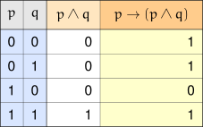
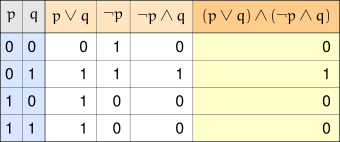
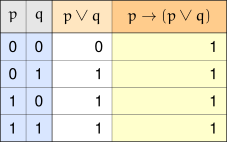
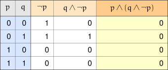

+++
title = 'Satisfiability'
type = 'chapter'
weight = 4

[params]
  section = 4
+++

We've seen plenty of primitive propositions whose truth values are fixed:

\[
\begin{array}{ll}
\text{Calvin Coolidge was the 30th President of the United States of America.} & \text{(true)} \\ \\
\text{Mitochondria convert ADP into ATP via cellular respiration.} & \text{(true)} \\ \\
\text{Leonardo da Vinci painted the famous ceiling fresco in the Sistine Chapel.} & \text{(false)}
\end{array}
\]

We've also seen compound propositions whose truth values depend on the
truth values of its atomic propositions.

\[
\begin{array}{ll}
2+2=5 \text{ and } 2+3=6. & \text{(false)} \\ \\
\text{Parallelograms with four equal sides and four equal angles are squares.} & \text{(true)} \\ \\
\text{If an integer is prime and even, then that integer is two.} & \text{(true)} \\ \\
\text{If } x=2 \text{ or } x=3 \text{, then } x^2-5x+6=0. & \text{(true)}
\end{array}
\]

Typically, the compound propositions we work with are made up of generic
propositions that could be true, or could be false. This means we
need to examine all combinations of truth values for the atomic
propositions to determine the overall truth value of the compound proposition.

Of course, we usually will only be interested in compound propositions
that are true. This is how we frame the upcoming discussion: when are compound propositions true?

## Propositions that are Sometimes True
---

We've seen some examples of compound propositions that — for some
combinations of truth values — are true.


We construct a truth table. We'll highlight the column we are interested in examining.

Only some of the combinations of truth values for $p$ and $q$ yield a
truth value of $1$ when combined in the desired compound proposition.
Those combinations are as follows: $p=0,q=0$; $p=0,q=1$; and $p=1,q=1$.

Only one combination yields a false truth value ($0$) when combined:
$p=1,q=0$.


Let's dispense with the suspense; we already know what word we'll use to
describe compound propositions that can be true.


A compound proposition is called ==satisfiable== if there exists some
combination of truth values for its atomic propositions that yield a
truth value of $1$.




Here, we see that there is only one combination of truth values for $p$
and $q$ for where $(p \lor q) \land (\neg p \land q)$ is true, namely
$p=0,q=1$.

Hence, $(p \lor q) \land (\neg p \land q)$ is satisfiable, even if just
barely.


## Propositions that are Always True
---

We have yet to see a proposition that is always true, no matter what
combinations of truth values are assigned to its atomic propositions.


We've seen $p \to (p \land q)$ above, but changing to the disjunction
yields interesting changes.

Notice that every row in the final column contains $1$.



A compound proposition is called a ==tautology== when it is always true,
no matter what truth values are taken by its atomic propositions.


Sometimes when we come across a tautology in an expression, we can
replace it with the symbol $\top$ (sometimes also written $T_0$), but
since the truth value is always $1$, we can always replace the expression
with its truth value $1$.

It should be noted that it may preferable to either use $\top$ or $T_0$ when working with 
propositions, because those symbols have additional context to them than the literal value $1$. Those 
symbols signify that we are working with a proposition always happens to be true.

## Propositions that are Never True
---

We've seen a proposition that is always true, but are there propositions
that are never true?



Of course, we should probably expect this proposition to always be
false, because it is asserting both $p$ and $\neg p$.


You can't assert both $p$ and $\neg p$, because they contradict each
other — which leads us to our next definition.


A compound proposition is a ==contradiction== when it is always false, no
matter what truth values are assumed by its atomic propositions.


Just like with tautologies, we sometimes use the symbol $\bot$ (sometimes
also written $F_0$) to represent a contradiction. But since a
contradiction is always false, we can also just use $0$ — though we may
prefer $\bot$ or $F_0$ if we wish to convey that we're talking about a
proposition, rather than a literal value.
