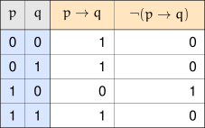
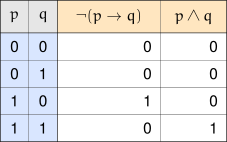
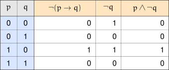

+++
title = 'Simplifying Logical Expressions'
type = 'chapter'
weight = 6

[params]
  section = 6
+++

In the previous section we saw an example where we used tautologically
true biconditionals to "simplify" complicated propositional expressions
into simpler propositional expressions. Whatever we could say about the
simpler expressions could also be said about their more complicated,
logically equivalent counterparts (except perhaps our preference for
working with the simpler expressions, of course).

In this section we do more work with logical equivalencies, similar to
what we saw in the examples seen previously. Our work here will bear a
striking resemblance to our experience in dealing with the arithmetic and
algebra of real numbers. In fact, the upcoming work we are about to
engage with has been dubbed the "algebra of propositions."

## Revisiting a Previous Example
---

In the previous example, we saw how to take a complicated proposition
and produce a simpler proposition that always had the same truth value.

Now that we have a big list of logical equivalencies under our belt, we
can see how to use those equivalencies to more quickly find equivalent
propositions, rather than trudge through truth tables all the time.


Previously, we made guesses about how the following propositions were
related to each other:

\[
\begin{align*}
& \neg \neg p \text{ compared to } p \\
& p \lor q \text{ compared to } q \lor p \\
& p \lor p \text{ compared to } p
\end{align*}
\]

and used what we found to make a bunch of truth tables, which is
reviewed below:

\[
\begin{align*}
\neg \neg p &\Longleftrightarrow p \\
p \lor q &\Longleftrightarrow q \lor p \\
p \lor p &\Longleftrightarrow p
\end{align*}
\]

Instead of using truth tables, let's just use the laws of logic.

\[
\begin{array}{ll}
(\neg \neg p \lor q) \lor p \Longleftrightarrow (p \lor q) \lor p & \text{by the Law of Double Negation} \\
(p \lor q) \lor p \Longleftrightarrow (q \lor p) \lor p & \text{by the Commutative Law of } \lor \\
(q \lor p) \lor p \Longleftrightarrow q \lor (p \lor p) & \text{by the Associative Law of } \lor \\
q \lor (p \lor p) \Longleftrightarrow q \lor p & \text{by the Idempotent Law of } \lor \\
q \lor p \Longleftrightarrow p \lor q & \text{by the Commutative Law of } \lor
\end{array}
\]

We probably could have used fewer steps by more carefully applying the
commutative and associative laws, but regardless, we arrived at the same
proposition as we did in Example 1.5.4.


## A New Example
---

Let's turn our sights to a new example we haven't seen before, and
compare using truth tables to using logical equivalencies.


We're interested in seeing if there's a simpler, equivalent way of
writing an expression like $\neg (p \to q)$ — one that doesn't use the
implication, but is instead just a combination of conjunctions,
disjunctions, and negations. First, let's construct a truth table for $\lnot (p \rightarrow q)$:

Suppose we didn't know about the Laws of Logic. How can we proceed? We
notice that there is only one $1$ in the column for $\neg (p \to q)$. We
may remember that the conjunction of $p$ and $q$ also only has one $1$
as well.

However, the $1$s aren't in the same row. Notice that if we swap the
$1$s and $0$s in the $q$ column, we can get the $1$s to line up with
those for $p$. But how do we swap $1$s and $0$s of a proposition?

We negate it! Let's add $\neg q$ to the table.

Now we see that $\neg (p \to q)$ and $p \land \neg q$ have the same
truth values for all combinations of truth values, meaning

$$[\neg (p \to q)] \leftrightarrow [p \land \neg q]$$

is a tautology.

Thus, we see that

$$[\neg (p \to q)] \Longleftrightarrow [p \land \neg q]$$

Using the truth table method required us to make keen observations on
how to work, manipulate, and coax truth values into the proper rows so
they line up.

What if we don't see a way to make values line up? Fortunately, there is
a way we can avoid relying on our ability to make clever observations:
we use the Laws of Logic!



Let's use the Laws of Logic we have seen to try and come up with a
logically equivalent proposition:

\[
\begin{array}{lll}
 & \boldsymbol{\neg (p \to q)} & \textbf{Reason} \\
\Longleftrightarrow & \neg (\neg p \lor q) & \text{Law of Material Implication} \\
\Longleftrightarrow & \neg \neg p \land \neg q & \text{DeMorgan's Law} \\
\Longleftrightarrow & p \land \neg q & \text{Law of Double Negation}
\end{array}
\]

This is the same proposition we got by using truth tables! We just used
logical equivalencies we were familiar with, instead of a keen eye
(which may have blind spots). There was also a lot less work involved
too!


## A Note on Organizing Logical Equivalencies
---

In the previous example, we listed the logical equivalencies on
separate lines, citing the logical law being appealed to. This is
certainly a fine way to organize one's work, and has its advantages.

In this book, we opt to use a tabular format to organize our work,
unless the occasion calls for some other format. We adopt a
three-column format:

\[
\begin{array}{lll}
\Longleftrightarrow & \text{Propositional Expression} & \text{Reason}
\end{array}
\]

We can demonstrate this format using the same proposition from the
previous example.


\[
\begin{array}{lll}
 & \boldsymbol{(\neg \neg p \lor q) \lor p} & \textbf{Reason} \\
\Longleftrightarrow & (p \lor q) \lor p & \text{Law of Double Negation} \\
\Longleftrightarrow & (q \lor p) \lor p & \text{Commutative Law of } \lor \\
\Longleftrightarrow & q \lor (p \lor p) & \text{Associative Law of } \lor \\
\Longleftrightarrow & q \lor p & \text{Idempotent Law of } \lor \\
\Longleftrightarrow & p \lor q & \text{Commutative Law of } \lor
\end{array}
\]

Notice that we skip the first row in the left column. We also use bold
font for the first row.


## One Big Example
---

We've seen a couple of examples where we use a couple of logical laws.
Some examples require more laws to simplify.


\[
\begin{array}{lll}
 & \boldsymbol{[(p \lor \neg r) \land ((q \lor p) \lor \neg r)] \land [(r \land s) \lor (r \land \neg s)]} & \textbf{Reason} \\
\Longleftrightarrow & [(p \lor \neg r) \land ((q \lor p) \lor \neg r)] \land [r \land (s \lor \neg s)] & \text{Distributive Law of } \land \\
\Longleftrightarrow & [(p \lor \neg r) \land ((q \lor p) \lor \neg r)] \land [r \land T_0] & \text{Inverse Laws} \\
\Longleftrightarrow & [(p \lor \neg r) \land ((q \lor p) \lor \neg r)] \land [r] & \text{Identity Laws} \\
\Longleftrightarrow & [(p \land (q \lor p)) \lor \neg r] \land [r] & \text{Distributive Law of } \lor \\
\Longleftrightarrow & [(p) \lor \neg r] \land [r] & \text{Absorption Laws} \\
\Longleftrightarrow & (p \land r) \lor (\neg r \land r) & \text{Distributive Law} \\
\Longleftrightarrow & (p \land r) \lor F_0 & \text{Inverse Law} \\
\Longleftrightarrow & p \land r & \text{Identity Law}
\end{array}
\]

One thing to notice is that initially, we had four atomic propositions:
$p$, $q$, $r$, and $s$. After all of our work above, we ended up with
only two: $p$ and $r$. This means that the large, complicated compound
proposition's truth value actually is unaffected by $q$ or $s$. The
truth value is driven, or affected, only by $p$ and $r$.

