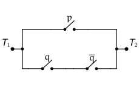
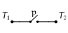
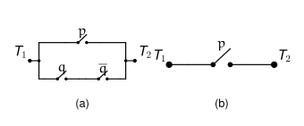
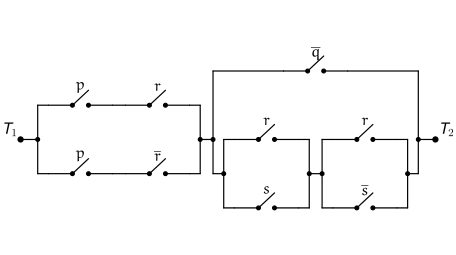
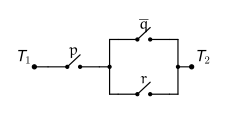
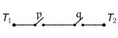
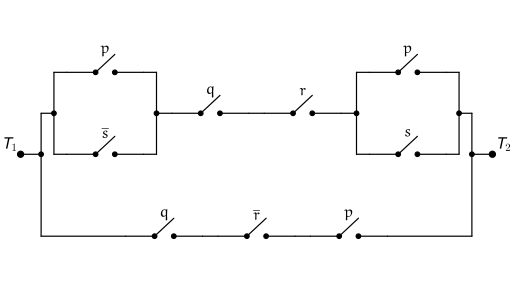

+++
title = 'Application: Switching Networks'
type = 'chapter'
weight = 7

[params]
  section = 7
+++

While the content we've seen so far seems ethereal, with little application
outside of simplifying logical propositions, logic dictates almost every
avenue of study. In our everyday lives, we like to think our actions are
reasonable and make sense. Certainly, we can use logic to analyze a
situation so we can maximize our profit from it, whether our profit is in
the form of friendship, promotions at work, happiness, health, or money.

One such application of logic has had a profound impact on human history.
In 1938, a paper "A Symbolic Analysis of Relay and Switching Circuits" was
published. In that paper, author Claude Shannon showed that Boolean Logic
(what we've been studying so far in this book) can be used to simplify the
design of relay circuits that were used in the construction of
electromechanical devices back in the day. (Likewise, these relay circuits
could be used to solve Boolean algebra problems, essentially meaning that
relay circuits are equivalent to Boolean/propositional expressions.)

This insight paved the way for future computer advancements, culminating
in the development of modern computer chip designs, including modern CPU,
GPU, and now TPU chip designs.

In this section, we take a look at a very basic framework for taking
"complicated" circuits and producing equivalent, simpler circuits.

## Electrical Circuits
---

An electrical circuit at its core is simply a network of switches that are
designed to allow or block electricity from flowing from one terminal to
another.

Here is the simplest switching network:



Here, $T_1$ is the starting terminal, and $T_2$ is the ending terminal.
Electrical current is applied at $T_1$.

Here, there is one switch, labeled $p$. In the diagram above, $p$ is
"open," meaning it isn't allowing electricity to flow through.

Here is the same circuit, with switch $p$ "closed," thus allowing
electricity to flow:



The connection between these circuits and logic is this: open switches
correspond to false propositions, and closed switches correspond to true
propositions.

So, the first circuit we saw corresponds to when $p$ represents a false
proposition ($p = 0$). The second circuit corresponds to when $p$
represents a true proposition ($p = 1$).



## Two Fundamental Circuits
---

Here we start by showing two circuits that are used to construct more
elaborate circuits.

Here is the first:



In order for electricity to flow from terminal $T_1$ to terminal $T_2$,
both switches $p$ and $q$ must be closed ($p = 1$ and $q = 1$).

This is exactly the same as saying $p \land q$: when either $p$ or $q$ is
open (equal to $0$), then there isn't a connected path from $T_1$ to
$T_2$. When both are closed (equal to $1$), then there is a path from
$T_1$ to $T_2$.

This circuit is called the "Series Circuit" and corresponds to the
conjunction operator.

Here is the second fundamental type of circuit: the "Parallel Circuit"



Here, we see that as long as at least one of $p$ or $q$ is closed (at
least one of $p$ or $q$ is equal to $1$), then electricity can flow from
$T_1$ to $T_2$.

Of course, saying $p$ or $q$ must be closed is equivalent to the
disjunction of $p$ and $q$: when $p \lor q = 0$, electricity can't flow
from $T_1$ to $T_2$. When $p \lor q = 1$, electricity can flow.

From just these two circuits, we can build up many useful circuits.

## A Simple Example
---

The ability to simplify circuits relies on our ability to model a given
circuit as a proposition containing a combination of atomic propositions,
negations, conjunctions, and disjunctions.

We do that by identifying the series and parallel circuits being used in
the given circuit.



This is a parallel circuit between a single switch $p$ and a series
circuit consisting of $q$ and $\neg q$.

Thus, we model this circuit as

$$p \lor (q \land \neg q)$$

Now, we can use the laws of logic to simplify this proposition:

\[
\begin{array}{lll}
 & \boldsymbol{p \lor (q \land \neg q)} & \textbf{Reason} \\
\Longleftrightarrow & p \lor F_0 & \text{Inverse Law of } \land \\
\Longleftrightarrow & p & \text{Identity Law}
\end{array}
\]

So, we can simplify $[p \lor (q \land \neg q)]$ to just $p$. The circuit
for $p$ is below:

We have just produced a circuit that is equivalent to the circuit we were
given, but is much simpler:



## A Complex Example
---

We can take a more complicated circuit and do the same thing:


Consider the following circuit:

There are two sub-circuits connected in series:

$$[\quad] \land [\quad]$$

The first part is a parallel circuit consisting of a series circuit along
each branch:

$$[(p \land r) \lor (p \land \neg r)] \land [\quad]$$

The second sub-circuit consists of another parallel circuit, the second
branch of which is more complicated:

$$[(p \land r) \lor (p \land \neg r)] \land [(\neg q) \lor [(r \lor s) \land (r \lor \neg s)]]$$

Now that we have the underlying proposition, we can simplify:

\[
\begin{array}{lll}
 & \boldsymbol{[(p \land r) \lor (p \land \neg r)] \land [(\neg q) \lor [(r \lor s) \land (r \lor \neg s)]]} & \textbf{Reason} \\
\Longleftrightarrow & [p \land (r \lor \neg r)] \land [(\neg q) \lor [(r \lor s) \land (r \lor \neg s)]] & \text{Distributive Law} \\
\Longleftrightarrow & [p \land T_0] \land [(\neg q) \lor [(r \lor s) \land (r \lor \neg s)]] & \text{Inverse Law} \\
\Longleftrightarrow & p \land [(\neg q) \lor [(r \lor s) \land (r \lor \neg s)]] & \text{Identity Law} \\
\Longleftrightarrow & p \land [(\neg q) \lor [r \lor (s \land \neg s)]] & \text{Distributive Law} \\
\Longleftrightarrow & p \land [(\neg q) \lor [r \lor F_0]] & \text{Inverse Law} \\
\Longleftrightarrow & p \land [(\neg q) \lor r] & \text{Identity Law}
\end{array}
\]

This final proposition doesn't seem to admit any further simplifications
using the laws of logic at our disposal.

As such, we accept this final proposition for our simplified circuit:



## Obfuscating Circuits
---

Something we could do, if we were worried someone may take our circuit
designs, is to obfuscate them by taking a simple circuit and using the
laws of logic "in reverse," so to speak, to produce an equivalent, more
complicated circuit.


A deranged mad man is planning to abduct a group of people and force them
to solve a series of puzzles to survive.

One such puzzle involves opening and closing a network of valves designed
to carry a liquid antidote to a poison the mad man will administer to his
victims. If the kidnapped individuals can configure the valves in a
satisfiable way, the liquid antidote will be carried through the plumbing
network to vials the victims can drink from.

Initially, the mad man starts with just

$$p \land q$$

but wants to design a more complicated network to hide the simplicity, so
the lunatic uses the laws of logic in the following way:

\[
\begin{array}{lll}
 & \boldsymbol{p \land q} & \textbf{Reason} \\
\Longleftrightarrow & p \land (q \land T_0) & \text{Identity Law} \\
\Longleftrightarrow & p \land (q \land (r \lor \neg r)) & \text{Inverse Law} \\
\Longleftrightarrow & p \land [(q \land r) \lor (q \land \neg r)] & \text{Distributive Law} \\
\Longleftrightarrow & [p \land (q \land r)] \lor [p \land (q \land \neg r)] & \text{Distributive Law} \\
\Longleftrightarrow & [(p \lor F_0) \land (q \land r)] \lor [p \land (q \land \neg r)] & \text{Identity Law} \\
\Longleftrightarrow & [(p \lor (s \land \neg s)) \land (q \land r)] \lor [p \land (q \land \neg r)] & \text{Inverse Law} \\
\Longleftrightarrow & [((p \lor s) \land (p \lor \neg s)) \land (q \land r)] \lor [p \land (q \land \neg r)] & \text{Distributive Law} \\
\Longleftrightarrow & [(p \lor \neg s) \land (q \land r) \land (p \lor s)] \lor [p \land (q \land \neg r)] & \text{Commutative Law} \\
\Longleftrightarrow & [(p \lor \neg s) \land (q \land r) \land (p \lor s)] \lor [q \land \neg r \land p] & \text{Commutative Law}
\end{array}
\]

So essentially, we started with the following plumbing circuit:

and constructed the following circuit:

The mad man is pleased with his new design, and implements it for his
plan. Or he would have, had he not been caught by investigators for his
recent tax fraud schemes.


In the previous example, we saw how the laws of logic can be used to turn
simple propositions into more complex ones. For example, a combination of
the identity laws and inverse laws allow us to introduce superfluous
atomic propositions.

We also saw that propositions can be used to model non-electric networks
as well, such as a valved plumbing network. Any kind of gated network can
be modeled as a proposition.
