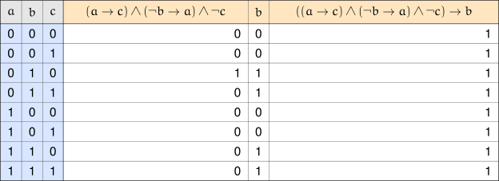

+++
title = 'Arguments'
type = 'chapter'
weight = 5

[params]
  section = 5
+++

The heart of mathematics is not mere computation, but the act of taking
a combination of known facts and combining them in some way to arrive at
new conclusions. Think back to when you learned the Pythagorean Theorem
or the Quadratic Formula. It's certainly true that these tools help you
compute things — the hypotenuse of a right triangle, or the roots of a
quadratic function — but that's a computational activity.

Without the Pythagorean Theorem or the Quadratic Formula, how would we
go about computing those quantities in the first place? There may be
other methods available, but those two tools in particular are
extremely helpful — and the reason they exist is that someone took what
was already known about right triangles and quadratic expressions, and
arrived at the now-famous results. The difference between *doing
mathematics* and *computing* is a little like this: mathematics is
*knowing* that for all right triangles, where the legs have lengths $a$
and $b$, and the hypotenuse has length $c$, we have

$$a^2 + b^2 = c^2;$$

computation is figuring out that a right triangle with leg lengths $5$
and $12$ has a hypotenuse of length $13$ *using* the Pythagorean
Theorem.

In order to know anything in mathematics, we start with what's
currently known, and extrapolate from that prior knowledge. We call
this *providing an argument*, or a *proof*. In this section, we examine
the basic structure of such an argument.

## Premises and Conclusions
---

Let's elaborate on the idea of using existing knowledge. We essentially
take a collection of known facts together, and their combination
provides some new fact:

\[
\begin{array}{ll}
\text{IF} & \text{known fact \#1} \\
\text{AND} & \text{known fact \#2} \\
\text{AND} & \text{known fact \#3} \\
 & \vdots \\
\text{AND} & \text{known fact \#}n \\
\text{THEN} & \text{new fact.}
\end{array}
\]

Notice that we combine several facts using the word "and." All the
facts are supposed to come together in order to create the new fact —
if any fact could be left out, then it wasn't needed. This is the same
situation we had with the conjunction $\land$: every proposition
attached to a conjunction has to be true in order for the conjunction
itself to be true.

Let's rewrite the representation above using mathematical notation,
where $p_1$ represents known fact #1 (a fact is just another term for a
proposition), $p_2$ represents known fact #2, and so on through $p_n$
for known fact #$n$, with the letter $c$ denoting the new fact:

$$(p_1 \land p_2 \land p_3 \land \dots \land p_n) \to c.$$


Consider a collection of $n+1$ propositions $p_1, p_2, p_3, \dots, p_n,
c$. An implication of the form

$$(p_1 \land p_2 \land p_3 \land \dots \land p_n) \to c$$

is called an ==argument==. The propositions $p_1, p_2, p_3, \dots, p_n$
within the repeated conjunction are called the ==premises== of the
argument. The proposition $c$ is called the ==conclusion== of the
argument.


Notice that this definition doesn't require the premises to be
primitive propositions — each premise can be primitive, or it can be
some long, complicated compound proposition. What matters is that we
combine all of the premises into a conjunction.

## Valid Arguments
---


Let $a$, $b$, $c$ represent the following propositions:

\[
\begin{array}{rl}
a\text{: } &\text{The vault door is locked overnight.} \\
b\text{: } &\text{A thief breaks into the vault.} \\
c\text{: } &\text{The morning audit turns up clean.}
\end{array}
\]

Now consider an argument with the following premises:

\[
\begin{array}{rl}
p_1\text{: } &a \to c \\
p_2\text{: } &\neg b \to a \\
p_3\text{: } &\neg c
\end{array}
\]

The argument we want to examine is $(p_1 \land p_2 \land p_3)
\to b$.

We know that an implication is only false when the hypothesis is true
and the conclusion is false. Working through a truth table for all
three atomic propositions confirms that, in every row where $p_1 \land
p_2 \land p_3$ is true, the conclusion $b$ is true as well — meaning the
overall implication $(p_1 \land p_2 \land p_3) \to b$ has
$1$s all the way down its column, and is a tautology.

As such, we can write

$$(p_1 \land p_2 \land p_3) \Longrightarrow b.$$

So, the argument is a logical implication. Therefore, if

\[
\begin{array}{l}
\text{The vault door is locked overnight, then the morning audit turns} \\
\text{up clean;} \\[0.75em]
\text{If no thief breaks into the vault, then the vault door is locked} \\
\text{overnight; and} \\[0.75em]
\text{The morning audit does not turn up clean}
\end{array}
\]

are all true propositions, then a thief likely broke into the vault
somehow.


The previous example demonstrates something important about arguments:
an argument asserts that, when all premises are true, the conclusion is
also true. If there's a scenario where all premises are true but the
conclusion isn't, then that argument doesn't accurately reflect when
the conclusion is true.

In order for an argument to accurately reflect when its conclusion is
true, the conclusion must be true whenever the premises are true —
otherwise, the argument is simply wrong.

On the other hand, we don't care what happens when any of the premises
are false. An argument only tells us that if all premises are true,
then so is the conclusion — it's irrelevant when any premise is false.


Consider an argument of the form $(p_1 \land p_2 \land p_3 \land \dots
\land p_n) \to c$. If the implication is a tautology — that
is, if it's a logical implication with

$$(p_1 \land p_2 \land p_3 \land \dots \land p_n) \Longrightarrow c,$$

then we call the argument a ==valid== argument.


Mathematics is all about developing valid arguments, because these
arguments form the base of the knowledge we have. Arguments give us a
way to come up with new and efficient ways to perform computations, make
classifications, or establish any other kind of equivalency.


Consider three propositions $x$, $y$, $z$ — none of which have to be
primitive, they just each denote some proposition, whether simple,
complex, or anywhere in between.

Now consider the following argument:

$$(p_1 \land p_2) \to c$$

where

\[
\begin{array}{rl}
p_1\text{: } &x \to y \\
p_2\text{: } &y \to z \\
c\text{: } &x \to z
\end{array}
\]

Filling out a truth table for $x$, $y$, $z$ and each of these
propositions in turn confirms that the column for $[(x \to y) \land (y
\to z)] \to (x \to z)$ is entirely $1$s.

![The truth table for $x \to y$, $y \to z$, $(x \to y) \land (y \to z)$, $x \to z$, and $[(x \to y) \land (y \to z)] \to (x \to z)$.](02.svg)

As such, the argument

$$[(x \to y) \land (y \to z)] \to (x \to z)$$

is valid. Therefore, if we ever run into a situation where we know that
$x \to y$ and that $y \to z$, then we know that
$x \to z$ as well, where $x$, $y$, and $z$ represent
arbitrary propositions.

