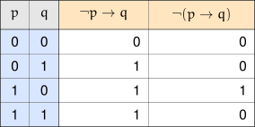
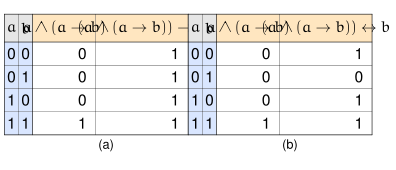

+++
title = 'Logical Implications'
type = 'chapter'
weight = 3
draft = true

[params]
  section = 3
+++

We already know, from the Law of Material Implication, that
$p \to q$ is logically equivalent to $\neg p \lor q$. Before
moving on, it's worth building some intuition for why that's true, and
seeing what it buys us.


Suppose we have $p \to q$ where

\[
\begin{array}{rl}
p\text{: } &\text{Alyssa studies for her Chemistry exam.} \\
q\text{: } &\text{Alyssa gets an A on her Chemistry exam.}
\end{array}
\]

What can we deduce if we know $\neg p$ is true (meaning $p$ is false)?
In this scenario, Alyssa doesn't study for her Chemistry exam. Does this
mean she doesn't get an A on her Chemistry exam?

Not necessarily. Remember, all we know is that if she studies, she'll
get an A — we weren't told $\neg p \to \neg q$. Perhaps the
exam is easy enough that Alyssa doesn't feel the need to study. Perhaps
the exam is difficult, but Alyssa is comfortable enough with the
material to work out correct answers with a little thought. On the
other hand, the exam could be extremely difficult for Alyssa, so maybe
she doesn't get an A. All we can conclude is that she didn't study — we
can't determine whether we have $q$ or $\neg q$.

What if we know we have $p$ instead of $\neg p$? Since we know that if
Alyssa studies, she'll get an A, knowing that $p$ happened tells us that
$q$ happened as well. (Note that since we're asserting $p \to
q$ is true, we can't have $p \to \neg q$.)

Our conclusion hinges entirely on the truth value of $p$: if $\neg p$
happened, we don't get any additional conclusions, but if $p$ happened,
we immediately know $q$ happens too. This is exactly the behavior of the
disjunction $\neg p \lor q$ — which is precisely why
$p \to q \Longleftrightarrow \neg p \lor q$ in the first place.


Keeping this equivalence in mind makes negating an implication far less
error-prone. As a reminder, from the Simplifying Logical Expressions
section, we already worked out that

$$\neg (p \to q) \Longleftrightarrow p \land \neg q,$$

which lines up with what we'd expect: an implication is false exactly
when $p$ is true and $q$ is false.

It's worth emphasizing why parentheses matter here. An expression such
as $\neg p \to q$ is shorthand for $(\neg p) \to
q$ — the negation $\neg$ is the most tightly-binding operation in an
expression, so it only applies to $p$, not to the whole implication.
This is a very different statement from $\neg (p \to q)$,
as the truth table below makes clear.

Any doubts about how an expression should be parsed can always be put
to rest by adding parentheses of your own.

## Tautologically True Implications
---


Consider the statement $a \land (a \to b)$, where

\[
\begin{array}{rl}
a\text{: } &\text{Smith wields a red lightsaber.} \\
b\text{: } &\text{Smith is a Sith.}
\end{array}
\]

A direct translation of this statement would be "Smith wields a red
lightsaber, and if Smith wields a red lightsaber, then Smith is a
Sith." Notice that this statement alone doesn't say that Smith is a
Sith directly — but since we know Smith wields a red lightsaber, we can
use the implication to deduce that Smith is a Sith. So the conclusion we
draw from both parts together is $b$.

What if we already knew $b$ — that Smith was a Sith? Does that give us
enough information to conclude $a \land (a \to b)$? If
$a = 0$ and $b = 1$, then $b \to (a \land (a \to
b))$ would be false. In other words, we have

$$(a \land (a \to b)) \to b,$$

but not

$$b \to (a \land (a \to b)).$$

The truth tables below confirm this:

In (a), the truth table for $(a \land (a \to b))
\to b$ has all $1$s in the last column, so this implication
is a tautology. But in (b), the biconditional $(a \land (a
\to b)) \leftrightarrow b$ has a single $0$ in its last
column — it's satisfiable, but not a tautology.


There's a special name for these kinds of implications.


Suppose $a$ and $b$ are any arbitrary statements (primitive or compound)
such that the implication $a \to b$ is always true — in
other words, a tautology. We say that $a$ ==logically implies== $b$, and
we write

$$a \Longrightarrow b.$$

If $a \to b$ is not a tautology, we write $a \not\Longrightarrow
b$.


Based on the previous example, where we saw that $(a \land (a
\to b)) \to b$ was a tautology, we can use this
new notation and write

$$(a \land (a \to b)) \Longrightarrow b.$$
