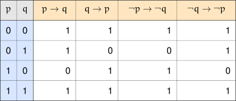

+++
title = 'Variations on the Implication'
type = 'chapter'
weight = 2

[params]
  section = 2
+++

There are some simple ways we can change around an implication. Exactly
how we make these changes affects how the new implication we form is
related to our original starting implication. In this section, we look
at three such variations — the converse, the inverse, and the
contrapositive — and see how each one relates back to the implication we
started with.

## The Converse, Inverse, and Contrapositive
---

The first two modifications are relatively straightforward.


Consider the implication $p \to q$, which will act as our
starting point. Here, $p$ and $q$ could be primitive or compound
statements themselves.

The ==converse== of $p \to q$ is the implication
$q \to p$.

The ==inverse== of $p \to q$ is the implication
$\neg p \to \neg q$.


Basically, the converse is obtained by swapping the two statements on
either side of the arrow $\to$. The inverse is obtained by
negating both statements on either side of the arrow $\to$.

Of course, we can apply both transformations at the same time. There's a
special name for that transformation as well.


Consider the implication $p \to q$, where $p$ and $q$ could
be primitive or compound statements themselves.

The ==contrapositive== of $p \to q$ is the implication
$\neg q \to \neg p$.


As always, an example in plain English will illuminate some key aspects
of these kinds of propositions.


Consider the implication $t \to s$ where

\[
\begin{array}{rl}
t\text{: } &\text{Taylor Swift releases a new album.} \\
s\text{: } &\text{The album will be successful.}
\end{array}
\]

The converse could be translated as

$$\text{If an album is successful, then it was released by Taylor Swift.}$$

The inverse can be translated as

$$\text{If Taylor Swift does not release an album, then that album will not be successful.}$$

Finally, the contrapositive would basically read

$$\text{If an album is not successful, then it was not released by Taylor Swift.}$$

Based on Taylor Swift's past success, the implication $t \to
s$ certainly seems like a reasonable statement that's always true.
However, notice that the converse doesn't always appear to be true —
plenty of successful albums have been released by artists other than
Taylor Swift. AC/DC's album *Back in Black* was a wildly successful
album, and Michael Jackson's *Thriller* is perhaps the best-selling
album of all time.

The inverse doesn't appear to be true all the time either (assuming
$t \to s$ is always true, of course) — again, other artists
release successful albums all the time.

The contrapositive is more interesting. Any non-successful album
couldn't have been released by Taylor Swift, because if it had been,
then it would have been successful — Taylor Swift doesn't make
unsuccessful albums. So the contrapositive does seem to always be true.
Furthermore, if we suppose $t \to s$ were false (unfathomable,
but let's imagine it for the sake of argument), then the contrapositive
would also be false.

We have the following truth table relating an implication to its
converse, inverse, and contrapositive.

Notice that the values in the $p \to q$ column exactly match
the values in the contrapositive column. This tells us that an
implication is always logically equivalent to its contrapositive; in
other words,

$$p \to q \Longleftrightarrow \neg q \to \neg p.$$

Additionally, the values in the converse column exactly match those of
the inverse column. This tells us that an implication's converse is
logically equivalent to its inverse, meaning

$$q \to p \Longleftrightarrow \neg p \to \neg q.$$


Yet again, this is worth highlighting.


\[
\begin{array}{lcl}
p \to q & \Longleftrightarrow & \neg q \to \neg p \\
q \to p & \Longleftrightarrow & \neg p \to \neg q
\end{array}
\]


Since we've figured out that an implication is logically equivalent to
its contrapositive, we could have deduced that the converse and inverse
are logically equivalent just by noticing that the inverse is the
contrapositive of the converse (and vice versa).
